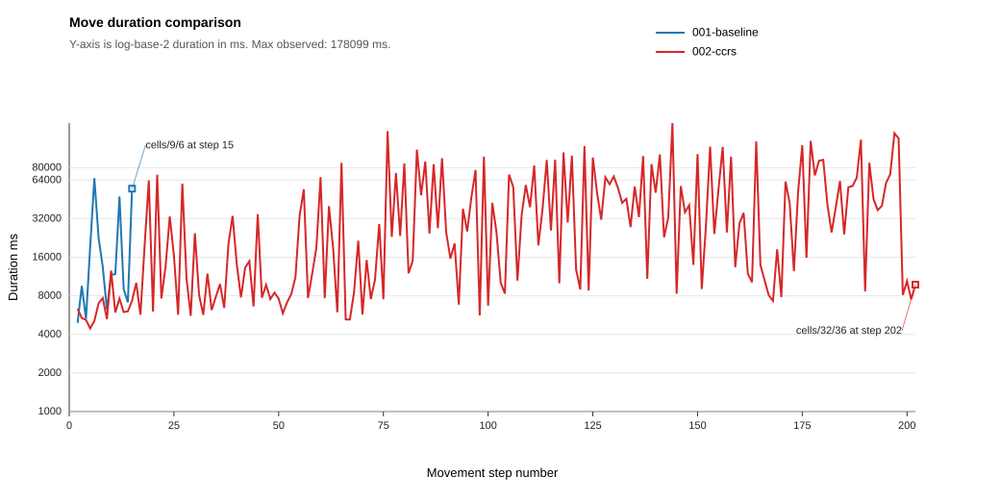
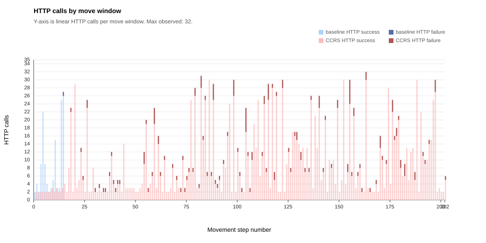
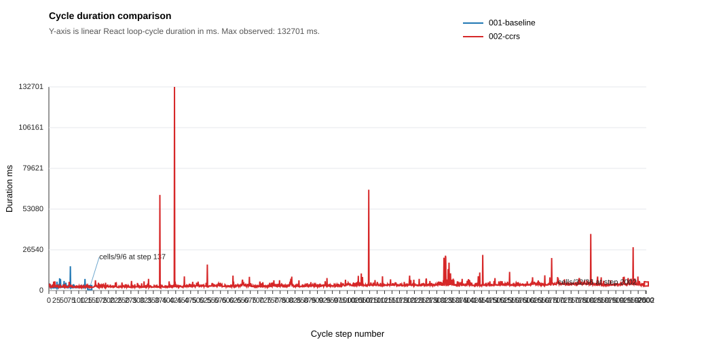

# React Experiment Summary: react-baseline-vs-ccrs-v1-t2

Generated: 2026-06-25 19:46:01 +02:00

Run root: `S:\dev\ma\ccrs-react\experiments\runs\react-baseline-vs-ccrs-v1-t2`

Metric definitions: [METRICS.md](../../METRICS.md)

## Core Metrics

| Run | Agent | Mode | Reached exit | Total duration ms | Total moves | Avg move duration | Final cell |
| --- | --- | --- | --- | --- | --- | --- | --- |
| `001-baseline` | react_baseline_mazeV1_t2 | manual | no | 289689 | 15 | 20692.07 | `http://127.0.1.1:8080/cells/9/6` |
| `002-ccrs` | react_ccrs_mazeV1_t2 | manual | no | 7619098 | 202 | 37905.96 | `http://127.0.1.1:8080/cells/32/36` |

## Move Optimality

| Run | Agent | Optimal moves | Actual moves | Delta from optimal |
| --- | --- | --- | --- | --- |
| `001-baseline` | react_baseline_mazeV1_t2 | 138 | 15 | - |
| `002-ccrs` | react_ccrs_mazeV1_t2 | 138 | 202 | - |

## Move Duration Summary

| Baseline move avg ms | CCRS move avg ms |
| --- | --- |
| 20692.07 | 37905.96 |

Move averages use move-durations.csv, derived from move-action-correlation.csv. HTTP calls use the same move windows and are plotted separately.

## Move Duration Chart

X-axis is movement step number; y-axis is log-scaled move duration with ticks at 1000, 2000, 4000, 8000, 16000, 32000, 64000, and 80000 ms.

## HTTP Calls Chart

X-axis is movement step number; y-axis is linear HTTP calls from 0 to 35 in 2-call steps, stacked by success and failure per agent.

## Cycle Duration Summary

| Baseline cycle avg ms | CCRS cycle avg ms | CCRS opp 0 avg ms | CCRS cont invocation 1 avg ms | CCRS cont invocation 2 avg ms | CCRS cont invocation 3 avg ms | CCRS cont invocation 4 avg ms | CCRS cont invocation 5 avg ms |
| --- | --- | --- | --- | --- | --- | --- | --- |
| 2648.25 | 3819.43 | 3817.42 | 3170 | 4272 | 5239 | 4381 | 6031 |

Cycle averages use `cycle-durations.csv`. Fresh runs populate this from `react.loop.cycle` events emitted from the React state cycle channel; historical CCRS-only rows may fall back to older structured CCRS cycle events. Opportunistic CCRS cycle averages exclude cycles where contingency CCRS was activated.

## Cycle Duration Chart

X-axis is React loop-cycle step number; y-axis is linear cycle duration in milliseconds.

## Advisory-Follow Evidence

| Run | Opp CCRS present | Selections | Selected rank 1 (highest) | Selected rank 2 | Selected rank 3 | Selected rank 4 | Selected none | Rank unavailable |
| --- | --- | --- | --- | --- | --- | --- | --- | --- |
| `002-ccrs` | 0 | 541 | - | - | - | - | - | - |
| `002-ccrs` | 1 | 533 | 83 | - | - | - | 450 | 0 |
| `002-ccrs` | 2 | 726 | 68 | 40 | - | - | 618 | 0 |
| `002-ccrs` | 3 | 157 | 13 | 11 | 5 | - | 128 | 0 |
| `002-ccrs` | 4 | 45 | 2 | 1 | 2 | 1 | 39 | 0 |

Ranks are inferred by joining each selection to `react.ccrs.opportunistic.detected` rows in the same run and cycle, ordered by descending utility. `Selected none` means the selected URI matched none of those ranked opportunistic targets.

## Contingency CCRS Details

### Invocation 1: `002-ccrs`

| Strategy | Result | Action | Target | Confidence | Eval ms | Opportunistic guidance | No-help reason | Rationale |
| --- | --- | --- | --- | ---: | ---: | --- | --- | --- |
| `prediction_llm` | suggestion | post | `http://127.0.1.1:8080/cells/12/5` | 0.82 | 120188 | False | - | LLM suggests: post to http://127.0.1.1:8080/cells/12/5. Reasoning: The advertised POST operation on the current lock expects GreenKeyBodyShape with dyn:keyValue as a string, and the previous body used an undeclared prefix and the wrong dyn:useKey predicate instead...; situation=UNCERTAINTY; trigger=bad_post_payload; failed_action=http_post |
| `retry` | none | - | - | - | 0 | False | - | situation=UNCERTAINTY; trigger=bad_post_payload; failed_action=http_post |
| `backtrack` | none | - | - | - | 1 | False | - | situation=UNCERTAINTY; trigger=bad_post_payload; failed_action=http_post |
| `consultation` | none | - | - | - | 13 | False | - | situation=UNCERTAINTY; trigger=bad_post_payload; failed_action=http_post |

### Invocation 2: `002-ccrs`

| Strategy | Result | Action | Target | Confidence | Eval ms | Opportunistic guidance | No-help reason | Rationale |
| --- | --- | --- | --- | ---: | ---: | --- | --- | --- |
| `prediction_llm` | suggestion | post | `http://127.0.1.1:8080/cells/35/30` | 0.86 | 13647 | False | - | LLM suggests: post to http://127.0.1.1:8080/cells/35/30. Reasoning: The west link to 35/30 is advertised from the current cell and the earlier 403 was caused by trying to GET a non-current cell, so navigation should use POST to the target with entersFrom set to the...; situation=STUCK; trigger=stuck_navigation |
| `retry` | none | - | - | - | 0 | False | - | situation=STUCK; trigger=stuck_navigation |
| `backtrack` | no_help | - | - | - | 982 | False | PRECONDITION_MISSING | All checkpoints exceed maximum graph distance; situation=STUCK; trigger=stuck_navigation |
| `consultation` | none | - | - | - | 4 | False | - | situation=STUCK; trigger=stuck_navigation |

### Invocation 3: `002-ccrs`

| Strategy | Result | Action | Target | Confidence | Eval ms | Opportunistic guidance | No-help reason | Rationale |
| --- | --- | --- | --- | ---: | ---: | --- | --- | --- |
| `prediction_llm` | suggestion | post | `http://127.0.1.1:8080/cells/35/36` | 0.94 | 12329 | False | - | LLM suggests: post to http://127.0.1.1:8080/cells/35/36. Reasoning: The current cell advertises south as http://127.0.1.1:8080/cells/35/36 and the 403 came from incorrectly GETting a non-current adjacent cell, so navigate by POSTing to the target with entersFrom se...; situation=UNCERTAINTY; trigger=llm_self_escalation; failed_action=http_get |
| `retry` | none | - | - | - | 1 | False | - | situation=UNCERTAINTY; trigger=llm_self_escalation; failed_action=http_get |
| `backtrack` | none | - | - | - | 0 | False | - | situation=UNCERTAINTY; trigger=llm_self_escalation; failed_action=http_get |
| `consultation` | none | - | - | - | 4 | False | - | situation=UNCERTAINTY; trigger=llm_self_escalation; failed_action=http_get |

### Invocation 4: `002-ccrs`

| Strategy | Result | Action | Target | Confidence | Eval ms | Opportunistic guidance | No-help reason | Rationale |
| --- | --- | --- | --- | ---: | ---: | --- | --- | --- |
| `prediction_llm` | suggestion | post | `http://127.0.1.1:8080/cells/31/35` | 0.78 | 27475 | False | - | LLM suggests: post to http://127.0.1.1:8080/cells/31/35. Reasoning: You are currently at 31/36; north leads back to the just-confirmed dead-end 30/36 and east is a wall, so use the advertised west transition by POSTing to 31/35 with entersFrom set to the current ce...; situation=UNCERTAINTY; trigger=llm_self_escalation |
| `retry` | none | - | - | - | 0 | False | - | situation=UNCERTAINTY; trigger=llm_self_escalation |
| `backtrack` | none | - | - | - | 0 | False | - | situation=UNCERTAINTY; trigger=llm_self_escalation |
| `consultation` | none | - | - | - | 3 | False | - | situation=UNCERTAINTY; trigger=llm_self_escalation |

### Invocation 5: `002-ccrs`

| Strategy | Result | Action | Target | Confidence | Eval ms | Opportunistic guidance | No-help reason | Rationale |
| --- | --- | --- | --- | ---: | ---: | --- | --- | --- |
| `prediction_llm` | suggestion | post | `http://127.0.1.1:8080/cells/37/36` | 0.78 | 18849 | False | - | LLM suggests: post to http://127.0.1.1:8080/cells/37/36. Reasoning: The current cell advertises a concrete south transition to 37/36, while the red lock operation requires an unknown dyn:keyValue, so navigating south is safer than inventing a key payload.; situation=UNCERTAINTY; trigger=llm_self_escalation |
| `retry` | none | - | - | - | 0 | False | - | situation=UNCERTAINTY; trigger=llm_self_escalation |
| `backtrack` | none | - | - | - | 0 | False | - | situation=UNCERTAINTY; trigger=llm_self_escalation |
| `consultation` | none | - | - | - | 2 | False | - | situation=UNCERTAINTY; trigger=llm_self_escalation |

## Generated Artifacts

- `runs.csv`
- `agents.csv`
- `mase-events.csv`
- `mase-agent-moved.csv`
- `mase-transactions.csv`
- `cycle-durations.csv`
- `decisions.csv`
- `advisory-follow.csv`
- `contingency.csv`
- `opportunistic.csv`
- `actions.csv`
- `move-action-correlation.csv`
- `move-durations.csv`
- `java-library-evidence.csv`
- `move-duration-comparison.svg`
- `http-calls-by-move.svg`
- `cycle-duration-comparison.svg`
- `path-analysis-inputs/`
- `summary.json`
- `summary.md`

## Scope Notes

- This first report version intentionally reports only metrics with clear current sources.
- Java companion logs are reported as library evidence and are kept separate from React adapter selection metrics.
- BDI overrule and option-reordering metrics are not applicable to React advisory prompt injection.
