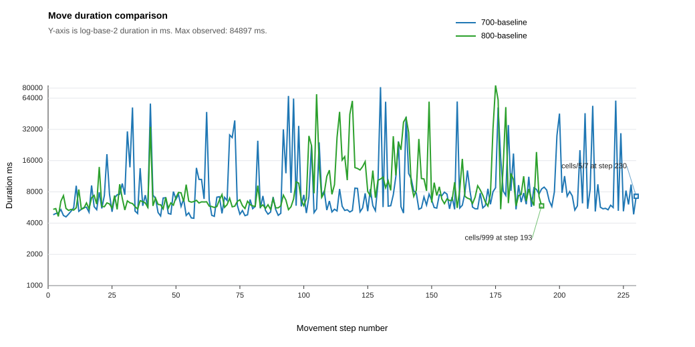
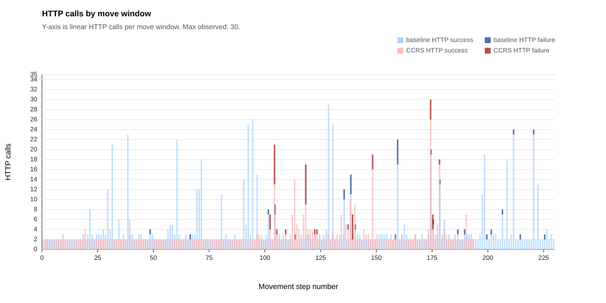
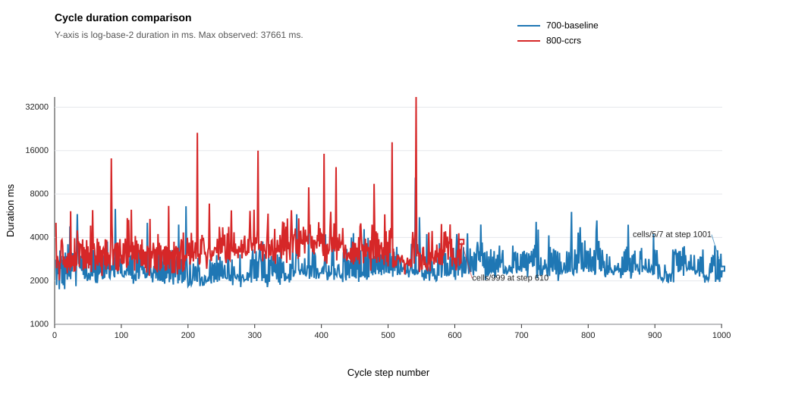

# React Experiment Summary: react-baseline-vs-ccrs-v2

Generated: 2026-06-27 16:43:00 +02:00

Run root: `S:\dev\ma\ccrs-react\experiments\runs\react-baseline-vs-ccrs-v2`

Metric definitions: [METRICS.md](../../METRICS.md)

## Core Metrics

| Run | Agent | Mode | Reached exit | Total duration ms | Total moves | Avg move duration | Final cell |
| --- | --- | --- | --- | --- | --- | --- | --- |
| `700-baseline` | react_baseline_mazeV2 | manual | no | 2575577 | 230 | 11247.06 | `http://127.0.1.1:8080/cells/5/7` |
| `800-baseline` | react_ccrs_mazeV2 | manual | yes | 2147139 | 193 | 11183.02 | `http://127.0.1.1:8080/cells/999` |

## Move Optimality

| Run | Agent | Optimal moves | Actual moves | Delta from optimal |
| --- | --- | --- | --- | --- |
| `700-baseline` | react_baseline_mazeV2 | 116 | 230 | - |
| `800-baseline` | react_ccrs_mazeV2 | 116 | 193 | 77 |

## Move Duration Summary

| Baseline move avg ms | CCRS move avg ms |
| --- | --- |
| 11217.85 | - |

Move averages use move-durations.csv, derived from move-action-correlation.csv. HTTP calls use the same move windows and are plotted separately.

## Move Duration Chart

X-axis is movement step number with interval ticks; y-axis is log-base-2 move duration in milliseconds starting at 1000 ms.

## HTTP Calls Chart

X-axis is movement step number; y-axis is linear HTTP calls from 0 to 35 in 2-call steps, stacked by success and failure per agent.

## Cycle Duration Summary

| Baseline cycle avg ms | CCRS cycle avg ms | CCRS opp 0 avg ms | CCRS cont invocation 1 avg ms | CCRS cont invocation 2 avg ms | CCRS cont invocation 3 avg ms | CCRS cont invocation 4 avg ms | CCRS cont invocation 5 avg ms | CCRS cont invocation 6 avg ms | CCRS cont invocation 7 avg ms |
| --- | --- | --- | --- | --- | --- | --- | --- | --- | --- |
| 2946.75 | - | - | 3562 | 3608 | 4546 | 2976 | 3600 | 3939 | 4652 |

Cycle averages use `cycle-durations.csv`. Fresh runs populate this from `react.loop.cycle` events emitted from the React state cycle channel; historical CCRS-only rows may fall back to older structured CCRS cycle events. Opportunistic CCRS cycle averages exclude cycles where contingency CCRS was activated.

## Cycle Duration Chart

X-axis is React loop-cycle step number with ticks every 100 cycles; y-axis is log-base-2 cycle duration in milliseconds starting at 1000 ms.

## Advisory-Follow Evidence

| Run | Opp CCRS present | Selections | Selected rank 1 (highest) | Selected rank 2 | Selected rank 3 | Selected rank 4 | Selected none | Rank unavailable |
| --- | --- | --- | --- | --- | --- | --- | --- | --- |
| `800-baseline` | 0 | 376 | - | - | - | - | - | - |
| `800-baseline` | 1 | 73 | 54 | - | - | - | 19 | 0 |
| `800-baseline` | 2 | 138 | 66 | 12 | - | - | 60 | 0 |
| `800-baseline` | 3 | 20 | 11 | 4 | 2 | - | 3 | 0 |
| `800-baseline` | 4 | 3 | 1 | 1 | 0 | 1 | 0 | 0 |

Ranks are inferred by joining each selection to `react.ccrs.opportunistic.detected` rows in the same run and cycle, ordered by descending utility. `Selected none` means the selected URI matched none of those ranked opportunistic targets.

## Contingency CCRS Details

### Invocation 1: `800-baseline`

| Strategy | Result | Action | Target | Confidence | Eval ms | Opportunistic guidance | No-help reason | Rationale |
| --- | --- | --- | --- | ---: | ---: | --- | --- | --- |
| `prediction_llm` | suggestion | post | `http://127.0.1.1:8080/cells/12/5` | 0.86 | 10111 | False | - | LLM suggests: post to http://127.0.1.1:8080/cells/12/5. Reasoning: The advertised Hydra POST expects GreenKeyBodyShape, whose required SHACL path is dyn:keyValue with a string value on the target lock resource, while the previous dyn:usesKey payload did not satisf...; situation=UNCERTAINTY; trigger=unexpected_structure |
| `retry` | none | - | - | - | 2 | False | - | situation=UNCERTAINTY; trigger=unexpected_structure |
| `backtrack` | none | - | - | - | 0 | False | - | situation=UNCERTAINTY; trigger=unexpected_structure |
| `consultation` | none | - | - | - | 12 | False | - | situation=UNCERTAINTY; trigger=unexpected_structure |

### Invocation 2: `800-baseline`

| Strategy | Result | Action | Target | Confidence | Eval ms | Opportunistic guidance | No-help reason | Rationale |
| --- | --- | --- | --- | ---: | ---: | --- | --- | --- |
| `prediction_llm` | suggestion | post | `http://127.0.1.1:8080/cells/33/25` | 0.78 | 16911 | False | - | LLM suggests: post to http://127.0.1.1:8080/cells/33/25. Reasoning: The current cell has only east and west exits, east leads back to the just-visited cell while the west link is available and its marker indicates the forward continuation, so move west by entering ...; situation=UNCERTAINTY; trigger=llm_self_escalation |
| `retry` | none | - | - | - | 2 | False | - | situation=UNCERTAINTY; trigger=llm_self_escalation |
| `backtrack` | none | - | - | - | 0 | False | - | situation=UNCERTAINTY; trigger=llm_self_escalation |
| `consultation` | none | - | - | - | 6 | False | - | situation=UNCERTAINTY; trigger=llm_self_escalation |

### Invocation 3: `800-baseline`

| Strategy | Result | Action | Target | Confidence | Eval ms | Opportunistic guidance | No-help reason | Rationale |
| --- | --- | --- | --- | ---: | ---: | --- | --- | --- |
| `prediction_llm` | suggestion | post | `http://127.0.1.1:8080/cells/29/25` | 0.93 | 9451 | False | - | LLM suggests: post to http://127.0.1.1:8080/cells/29/25. Reasoning: Cell 29/24 is a confirmed dead-end with walls north/south/west and only an east link plus marker to 29/25, so the safe recovery is to backtrack east to 29/25.; situation=UNCERTAINTY; trigger=llm_self_escalation |
| `retry` | none | - | - | - | 1 | False | - | situation=UNCERTAINTY; trigger=llm_self_escalation |
| `backtrack` | none | - | - | - | 0 | False | - | situation=UNCERTAINTY; trigger=llm_self_escalation |
| `consultation` | none | - | - | - | 6 | False | - | situation=UNCERTAINTY; trigger=llm_self_escalation |

### Invocation 4: `800-baseline`

| Strategy | Result | Action | Target | Confidence | Eval ms | Opportunistic guidance | No-help reason | Rationale |
| --- | --- | --- | --- | ---: | ---: | --- | --- | --- |
| `prediction_llm` | suggestion | post | `http://127.0.1.1:8080/cells/30/36` | 0.96 | 10244 | False | - | LLM suggests: post to http://127.0.1.1:8080/cells/30/36. Reasoning: The 403 states the agent is still at 31/36 and cannot GET 30/36 directly; 31/36 advertises a north link to 30/36 and prior successful moves use POST to the destination cell with dyn:entersFrom set ...; situation=FAILURE; trigger=consecutive_http_api_errors; failed_action=http_get |
| `retry` | none | - | - | - | 0 | False | - | situation=FAILURE; trigger=consecutive_http_api_errors; failed_action=http_get |
| `backtrack` | no_help | - | - | - | 96 | False | PRECONDITION_MISSING | All checkpoints exceed maximum graph distance; situation=FAILURE; trigger=consecutive_http_api_errors; failed_action=http_get |
| `consultation` | none | - | - | - | 2 | False | - | situation=FAILURE; trigger=consecutive_http_api_errors; failed_action=http_get |

### Invocation 5: `800-baseline`

| Strategy | Result | Action | Target | Confidence | Eval ms | Opportunistic guidance | No-help reason | Rationale |
| --- | --- | --- | --- | ---: | ---: | --- | --- | --- |
| `prediction_llm` | suggestion | post | `http://127.0.1.1:8080/cells/36/36` | 0.94 | 8081 | False | - | LLM suggests: post to http://127.0.1.1:8080/cells/36/36. Reasoning: The current cell advertises an open Hydra POST operation targeting 36/36 that expects RedKeyBodyShape requiring dyn:keyValue, and the previously observed RedKey fitting this lock has keyValue redke...; situation=UNCERTAINTY; trigger=unexpected_structure |
| `retry` | none | - | - | - | 1 | False | - | situation=UNCERTAINTY; trigger=unexpected_structure |
| `backtrack` | none | - | - | - | 0 | False | - | situation=UNCERTAINTY; trigger=unexpected_structure |
| `consultation` | none | - | - | - | 5 | False | - | situation=UNCERTAINTY; trigger=unexpected_structure |

### Invocation 6: `800-baseline`

| Strategy | Result | Action | Target | Confidence | Eval ms | Opportunistic guidance | No-help reason | Rationale |
| --- | --- | --- | --- | ---: | ---: | --- | --- | --- |
| `consultation` | suggestion | post | `http://127.0.1.1:8080/cells/44/45` | 0.99 | 1015 | False | - | External consultation via a2a (Key Holder Agent (key-holder-agent-1)/provide_blue_key) projected into action: post to http://127.0.1.1:8080/cells/44/45. Projected first literal-valued statement from consultation artifact onto current focus resource. @prefix dyn: &lt;https://paul.ti.rw.fau.de/~am52etar/dynmaze/dynmaze#&gt; .  &lt;http://127.0.1.1:8080/cells/42/41#key&gt; a dyn:BlueKey;     dyn:fitsInLock &lt;h...; situation=UNCERTAINTY; trigger=unexpected_structure |
| `prediction_llm` | suggestion | post | `http://127.0.1.1:8080/cells/43/45` | 0.86 | 13596 | False | - | LLM suggests: post to http://127.0.1.1:8080/cells/43/45. Reasoning: The BlueKey unlock operation requires a dyn:keyValue but no safe BlueKey value is available, while the current cell advertises a north link back to 43/45 and prior navigation uses POST to the desti...; situation=UNCERTAINTY; trigger=unexpected_structure |
| `retry` | none | - | - | - | 0 | False | - | situation=UNCERTAINTY; trigger=unexpected_structure |
| `backtrack` | none | - | - | - | 0 | False | - | situation=UNCERTAINTY; trigger=unexpected_structure |

### Invocation 7: `800-baseline`

| Strategy | Result | Action | Target | Confidence | Eval ms | Opportunistic guidance | No-help reason | Rationale |
| --- | --- | --- | --- | ---: | ---: | --- | --- | --- |
| `prediction_llm` | suggestion | post | `http://127.0.1.1:8080/cells/44/45` | 0.94 | 33483 | False | - | LLM suggests: post to http://127.0.1.1:8080/cells/44/45. Reasoning: The latest GET shows the agent is at locked cell 44/45 with an open BlueKey Hydra POST operation requiring dyn:keyValue, and bluekey-9347 previously unlocked this same lock successfully.; situation=UNCERTAINTY; trigger=unexpected_adjacency_count |
| `retry` | none | - | - | - | 0 | False | - | situation=UNCERTAINTY; trigger=unexpected_adjacency_count |
| `backtrack` | none | - | - | - | 0 | False | - | situation=UNCERTAINTY; trigger=unexpected_adjacency_count |
| `consultation` | none | - | - | - | 1 | False | - | situation=UNCERTAINTY; trigger=unexpected_adjacency_count |

## Generated Artifacts

- `runs.csv`
- `agents.csv`
- `mase-events.csv`
- `mase-agent-moved.csv`
- `mase-transactions.csv`
- `cycle-durations.csv`
- `decisions.csv`
- `advisory-follow.csv`
- `contingency.csv`
- `opportunistic.csv`
- `actions.csv`
- `move-action-correlation.csv`
- `move-durations.csv`
- `java-library-evidence.csv`
- `move-duration-comparison.svg`
- `http-calls-by-move.svg`
- `cycle-duration-comparison.svg`
- `path-analysis-inputs/`
- `summary.json`
- `summary.md`

## Scope Notes

- This first report version intentionally reports only metrics with clear current sources.
- Java companion logs are reported as library evidence and are kept separate from React adapter selection metrics.
- BDI overrule and option-reordering metrics are not applicable to React advisory prompt injection.
