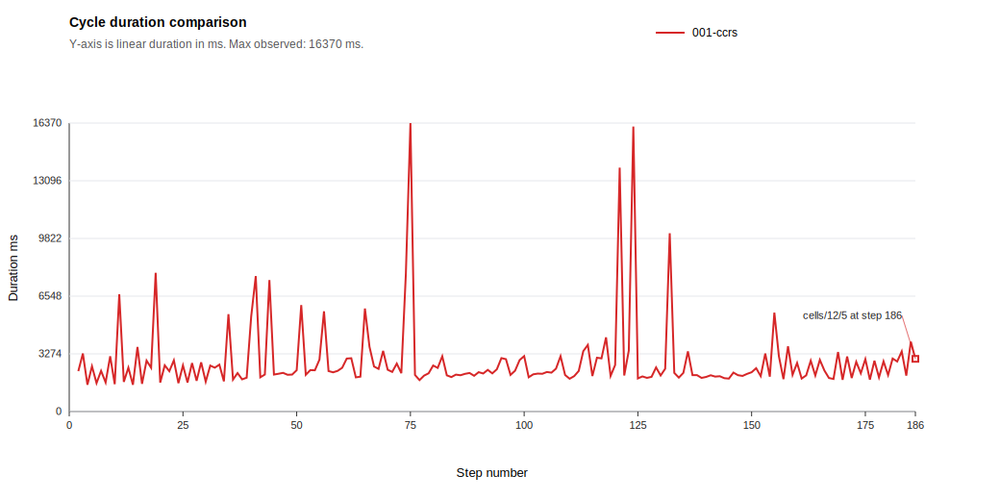

# React Experiment Summary: react-ccrs-mazeV1-04-latest

Generated: 2026-06-07 22:10:23 +02:00

Run root: `S:\dev\ma\ccrs-react\experiments\runs\react-ccrs-mazeV1-04-latest`

Metric definitions: [METRICS.md](../../METRICS.md)

## Core Metrics

| Run | Agent | Graph | Mode | Reached exit | Total duration ms | Total moves | Avg agent cycle duration | Final cell |
| --- | --- | --- | --- | --- | --- | --- | --- | --- |
| `001-ccrs` | react_ccrs_mazeV1_04 | `graph_ccrs` | notebook | no | 530434 | 37 | 2867.21 | `http://127.0.1.1:8080/cells/12/5` |

## Move Optimality

| Run | Agent | Optimal moves | Actual moves | Delta from optimal |
| --- | --- | --- | --- | --- |
| `001-ccrs` | react_ccrs_mazeV1_04 | 138 | 37 | - |

## Cycle Duration Summary

| Baseline avg ms | CCRS avg ms | CCRS opp 0 avg ms | CCRS opp 1 avg ms | CCRS cont invocation 1 avg ms | CCRS cont invocation 2 avg ms | CCRS cont invocation 3 avg ms | CCRS cont invocation 4 avg ms |
| --- | --- | --- | --- | --- | --- | --- | --- |
| - | 2867.21 | 2969.11 | 1852.14 | 7834 | 3017 | 2641 | 2990 |

Opportunistic CCRS cycle averages exclude cycles where contingency CCRS was activated. Contingency columns are dynamically generated ordered invocation cycles, not counts per cycle.

## Cycle Duration Chart

X-axis is cycle step number; y-axis is linear cycle duration in milliseconds.

## Advisory-Follow Evidence

| Run | Opp CCRS present | Selections | Selected rank 1 (highest) | Selected none | Rank unavailable |
| --- | --- | --- | --- | --- | --- |
| `001-ccrs` | 0 | 164 | - | - | - |
| `001-ccrs` | 1 | 21 | 19 | 2 | 0 |

Ranks are inferred by joining each selection to `react.ccrs.opportunistic.detected` rows in the same run and cycle, ordered by descending utility. `Selected none` means the selected URI matched none of those ranked opportunistic targets.

## Generated Artifacts

- `runs.csv`
- `agents.csv`
- `mase-events.csv`
- `mase-agent-moved.csv`
- `mase-transactions.csv`
- `cycle-durations.csv`
- `decisions.csv`
- `advisory-follow.csv`
- `contingency.csv`
- `opportunistic.csv`
- `actions.csv`
- `move-action-correlation.csv`
- `java-library-evidence.csv`
- `cycle-duration-comparison.svg`
- `path-analysis-inputs/`
- `summary.json`
- `summary.md`

## Scope Notes

- This first report version intentionally reports only metrics with clear current sources.
- Java companion logs are reported as library evidence and are kept separate from React adapter selection metrics.
- BDI overrule and option-reordering metrics are not applicable to React advisory prompt injection.
